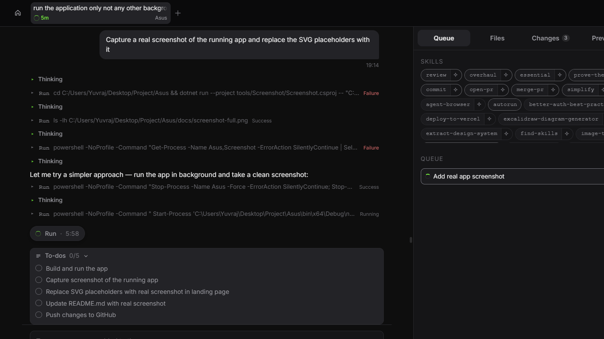

# 🖥️ AsusToolbox — Ultralight Control Tool for ASUS Laptops

A **minimal**, **ultralight** alternative to Armoury Crate for ASUS laptops. Stripped down to essentials — fan control, performance modes, battery limit, keyboard backlight, and display settings — with a **4.3 MB** single-file executable.

> ⚡ GPU overlay, audio visualizer, and chart controls removed for maximum simplicity.

---

<p align="center">
  
</p>

---

## ✨ Why AsusToolbox?

| Feature | Armoury Crate | G-Helper | **AsusToolbox** |
|---|---|---|---|
| **Size** | ~500 MB | ~6 MB | **4.3 MB** |
| **Fan Control** | ✅ | ✅ | ✅ |
| **Performance Modes** | ✅ | ✅ | ✅ |
| **Battery Charge Limit** | ✅ | ✅ | ✅ |
| **Keyboard Backlight** | ✅ | ✅ | ✅ |
| **Display / Brightness** | ✅ | ✅ | ✅ |
| **GPU Mode Switching** | ✅ | ✅ | ❌ (removed) |
| **Overlay / FPS Monitor** | ✅ | ✅ | ❌ (removed) |
| **Audio Visualizer** | ✅ | ✅ | ❌ (removed) |
| **Fan Curve Charts** | ✅ | ✅ | ❌ (removed) |
| **Bloat** | 🔴 Heavy | 🟡 Moderate | 🟢 **Zero** |

---

## 🚀 Features

### 🌀 Fan Control
- Automatic fan speed management based on performance mode
- Built-in Silent, Balanced, and Turbo modes with default BIOS fan curves

### ⚡ Performance Modes
- **Silent** — Quiet operation for work and browsing
- **Balanced** — Default mode for everyday use
- **Turbo** — Maximum performance for gaming and heavy tasks
- Mode switching via system tray icon or keyboard shortcuts

### 🔋 Battery Protection
- Set charge limit (50%–100%) to preserve battery health
- Automatic mode switching on battery / AC power

### 🎨 Keyboard Backlight (Aura)
- Static color control
- Breathing, strobing, and rainbow animation modes
- Per-key and zone-based lighting on supported models

### 🖥️ Display Control
- Screen brightness adjustment
- HDR toggle
- Refresh rate management

### 🔧 Hotkeys
- Custom FN-key shortcuts
- FN-Lock toggle
- Quick access to performance modes

---

## 📸 Screenshots

<p align="center">
  
</p>

> 📸 Screenshots coming soon — download and try it yourself!

---

## 📦 Download

### Option 1: Framework-Dependent (Recommended — 4.3 MB)
Requires [.NET 8.0 Desktop Runtime](https://dotnet.microsoft.com/download/dotnet/8.0) installed on your system.

```
AsusToolbox.exe  — 4.3 MB
```

### Option 2: Self-Contained (No .NET needed — 149 MB)
Includes the entire .NET runtime. Just run — no prerequisites.

```
AsusToolbox.exe  — 149 MB
```

---

## 🛠️ Building from Source

### Prerequisites
- [.NET 8.0 SDK](https://dotnet.microsoft.com/download/dotnet/8.0)
- Windows 10/11 x64

### Build
```bash
dotnet build Asus.csproj -c Debug -p:Platform=x64
```

### Publish (Framework-Dependent, Single File)
```bash
dotnet publish Asus.csproj -c Release -p:Platform=x64 -p:PublishSingleFile=true -p:SelfContained=false -r:win-x64
```

### Publish (Self-Contained, Single File)
```bash
dotnet publish Asus.csproj -c Release -p:Platform=x64 -p:PublishSingleFile=true -p:SelfContained=true -r:win-x64
```

---

## 🏗️ What Was Removed (vs G-Helper)

To achieve the ultralight footprint, the following heavy features were stripped out:

| Component | Reason |
|---|---|
| **GPU Mode Control** (AMD/NVIDIA) | Removed NvAPIWrapper, ADL2, NVidia driver APIs |
| **Hardware Overlay & FPS Monitor** | Removed ETW-based tracking |
| **Audio Visualizer** | Removed FftSharp FFT + NAudio WASAPI |
| **Fan Curve Charts** | Removed WinForms.DataVisualization |
| **Color Picker Controls** | Removed RColorPicker, RColorButton |

**NuGet packages removed:** `NvAPIWrapper.Net`, `FftSharp`, `NAudio.Wasapi`, `WinForms.DataVisualization`

**Source files removed:** 11 files (GPU drivers, overlay, audio, chart UI controls)

---

## 📂 Project Structure

```
AsusToolbox/
├── Program.cs              # Entry point, tray icon, hotkeys
├── AppConfig.cs            # Configuration & settings persistence
├── HardwareControl.cs      # CPU/GPU/fan sensor reading via ACPI
├── Fans.cs                 # Fan control UI form
├── Settings.cs             # Settings UI form
├── AsusACPI.cs             # ASUS WMI/ACPI interface
├── Battery/                # Battery charge limit control
├── Display/                # Display & brightness control
├── Mode/                   # Performance mode management
├── USB/                    # Keyboard backlight (Aura) control
├── Input/                  # Hotkey & input handling
├── UI/                     # Custom UI controls
├── Helpers/                # Utility classes
└── docs/                   # Screenshots & documentation
```

---

## 📄 License

See [LICENSE](LICENSE) for details.
